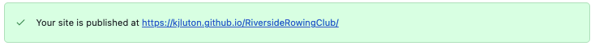

# Riverside Rowing Club Website 
## User-Centric Frontend Development Milestone Project 1

[insert image mock up here]

The [Riverside Rowing Club](https://kjluton.github.io/RiversideRowingClub/) website was built by Kirstyn Luton. ebsite presents Riverside Rowing Club as a successful rowing club in London. The rowing club has active members of all ages and abilities. They are currently recruiting new athletes for the new season and are promoting their 'Learn to Row' courses which take place in September. Users will find the content engaging, useful and will be able to navigate around the website in an efficient manner.

Disclaimer: This website has been built for entertainment and education purposes. It does not represent an actual rowing club. The website is build with HTML, CSS and Bootstrap framework. It should be responsive for multiple screen types.

## [View life website in github pages](https://kjluton.github.io/RiversideRowingClub/)
---

# Table of Contents

- [UX](#ux)
    - [Website owner business goals](#website-owner-business-goals)
    - [User goals](#user-goals)
        - [New user goals](##new-user-goals)
        - [Returning user goals](##returning-user-goals)
    - [User stories](#user-stories)
    - [Wireframes](#wireframes)
        - [Homepage - Wireframe](###homepage-wireframe)
        - [Join Us Page - Wireframe](###join-us-page-wireframe)
        - [Members Page - Wireframe](###members-page-wireframe)
        - [Contact Us Page - Wireframe](###contact-us-page-wireframe)
    - [Surface](#surface)
- [Features](#features)
- [Technology](#technology)
- [Testing](#testing)
    - [Functionality testing](#functionality-testing)
    - [Compatibility testing](#compatibility-testing)
    - [Code Validation](#code-validation)
    - [User stories testing](#user-stories-testing)
    - [Issues found during site development](#issues-found-during-site-development)
    - [Performance testing](#performance-testing)
- [Deployment](#deployment)
- [Credits](#credits)
- [Screenshots](#screenshots)

# UX

## Website owner business goals

Riverside Rowing club as a group are the website's owner. The website goal is to create an onlone presence for the Riverside Rowing Club to allow their members to get important information about the club and the rowing season. The website will also be used to promote the club to propspective memebrs and grow the rowing clubs membership holders. It will do this by providing information about the coaches, facilities and achievements. 

## User goals

### New user goals (prospective Rowing Club members):

- User is able to find out about the Rowing Club’s facilities, membership prices and location
- User is able to find out about the Rowing club’s goals and previous achievements, upcoming events and coaches
- User can download a membership form and get application details
- User can find the club location and contact relevant people.

### Returning user goals (Rowing Club members):
- User can find out about latest events the club is participating in.
- User can contact the club captain and or committee members.
- User can find important documents relating to the club.

## User stories

User 1:
Laura (40) is a mum of a Peter (15). Peter is a beginner rower and wants to join a rowing club in London. Laura is looking at the Rowing Club’s website to find out about the club, learn to row courses  and membership prices.

User 2:
John is a male, experienced rower in his early 20s. He has just moved to London and is not yet a member of the Rowing Club. He is looking to find out about the clubs’ facilities, achievements, future goals and membership details. He is looking at multiple clubs in the area to find the best fit for him. 

User 3:
Katie is a female in her late 30s. She is an experienced rower and a long-time member of the club. She wants to find out about upcoming race dates and volunteering opportunities. She also needs to buy some new kit as her old kit has worn out. 

## Wireframes

### Homepage - Wireframe

### Join Us Page - Wireframe

### Members Page - Wireframe

### Contact Us Page - Wireframe

## Surface

### Colours

The main colours used in this project are: 

Riverside Rowing Club logo blue: 
Riverside Rowing Club logo yellow: 
Link colour: 
Hover link colour: 

### Fonts

The header font used is BEBAS 
The body and paragraph font is 

### Images

I used a mixture of my own images and images from . I have credited these in the 

[Back to table of contents](#table-of-contents)

_______
# Features

The website consists of 3 pages. All are accessible from the navigation menu. 
the website has the below features: 

## Existing Features

### Elements on every page

#### Navigation bar 

* The navbar is full responsive and adapts to tablet and mobile devices by changing to a burger menu. 
* It features the Riverside Rowing Club logo as an image, on the far left of the Navbar. The logo can be used as a navigation tool on all pages, to navigate back to the homepage. 
* In the center there are 3 links which also collapse into a burger menu on smaller screen sizes. the menu contains: 
    * Home
    * Join Us
    * Contact

## Alert bar 
* The alert bar is visible on the "Homep" and "Join Us" pages of the website. It is dismissable by a small cross on the far right of the bar. The alert bar notfies the user of the "Learn to Row" courses and has a call to action to encourage users to contact us and find out more. There is a link directing the user to the "Contact Us" page of the website, where the user can use the contact form to ask questions and book a slot on the course. 

## Footer 

* Like the navigation bar, the footer is consitent across all pages. It has social links on the right hand side which change colour as you hover over them. Each link will open in a separate browser. 

## Club ethos 

## Useful links

## Racing and training kit 

## Join Us page 

## About us 

## membership fees 

## Squads 

## Club facilities

## Meet the coaches

## Contact Us page

* There is a contact page which hosts a contact form. 

## Future implementations

* Sign in area for members 
* XXX
* XXXX
* XXXX

[Back to table of contents](#table-of-contents)
_______

# Technologies Used

### HTML5

### CSS

### Bootstrap 

### Font Awesome 

### Google Fonts

### GitHub

### GitPod

### Balsamic 

Wireframing tool 

### Photoshop 

As image editor

[Back to table of contents](#table-of-contents)
_______

# Testing

## Functionality Testing
## Compatibility Testing
## Code Validation
## User Stories Testing
## Issues Found during site development
## Performance Testing
## Code Validation

[Back to table of contents](#table-of-contents)
_______
# Deployment

The project was deployed to GitHub Pages. Gitpod was used as the development workspace. I committed and logged all changes to the project, using the git command control system. At the end of each session, I used the git push command in the GitPod terminal to push all changes to the GitHub repository. 

To deploy the project I had to:

* Log in to GitHub and click on repository to deploy (https://github.com/KJLuton/RiversideRowingClub)
* Select 'Settings' and find the ‘Pages’ section at the bottom of the vertical menu, on the left hand side.
* From 'source', click where it says 'none' and update to 'branch: Master'. 
* Click 'save' and refresh your page to confirm deployment.  

To run locally: 
* Log into GitHub and click on the repository to download (https://github.com/KJLuton/RiversideRowingClub)
* Select 'code' and click 'Download" on the Zip File. 
* Once you download the file, you can extract it and use it in your local environment. 

[Back to table of contents](#table-of-contents)
_______
# Credits

## Content

## Media

#### Photos (Generla Rowing): 
Photo by <a href="https://unsplash.com/@mateovrb?utm_source=unsplash&utm_medium=referral&utm_content=creditCopyText">Mateo Vrbnjak</a> on <a href="https://unsplash.com/s/photos/rowing?utm_source=unsplash&utm_medium=referral&utm_content=creditCopyText">Unsplash</a>

Photo by <a href="https://unsplash.com/@mattyfours?utm_source=unsplash&utm_medium=referral&utm_content=creditCopyText">Matthew Fournier</a> on <a href="https://unsplash.com/s/photos/rowing?utm_source=unsplash&utm_medium=referral&utm_content=creditCopyText">Unsplash</a>
  
Photo by <a href="https://unsplash.com/@jannerboy62?utm_source=unsplash&utm_medium=referral&utm_content=creditCopyText">Nick Fewings</a> on <a href="https://unsplash.com/s/photos/rowing?utm_source=unsplash&utm_medium=referral&utm_content=creditCopyText">Unsplash</a>
  
Photo by <a href="https://unsplash.com/@rhysatwork?utm_source=unsplash&utm_medium=referral&utm_content=creditCopyText">Rhys Moult</a> on <a href="https://unsplash.com/s/photos/rowing?utm_source=unsplash&utm_medium=referral&utm_content=creditCopyText">Unsplash</a>
  
Photo by <a href="https://unsplash.com/@jeffreyflin?utm_source=unsplash&utm_medium=referral&utm_content=creditCopyText">Jeffrey F Lin</a> on <a href="https://unsplash.com/s/photos/rowing?utm_source=unsplash&utm_medium=referral&utm_content=creditCopyText">Unsplash</a>
  
Photo by <a href="https://unsplash.com/@joshcala?utm_source=unsplash&utm_medium=referral&utm_content=creditCopyText">Josh Calabrese</a> on <a href="https://unsplash.com/s/photos/rowing?utm_source=unsplash&utm_medium=referral&utm_content=creditCopyText">Unsplash</a>
  
Photo by <a href="https://unsplash.com/@mattyfours?utm_source=unsplash&utm_medium=referral&utm_content=creditCopyText">Matthew Fournier</a> on <a href="https://unsplash.com/s/photos/rowing?utm_source=unsplash&utm_medium=referral&utm_content=creditCopyText">Unsplash</a>
  
Photo by <a href="https://unsplash.com/@mitchel3uo?utm_source=unsplash&utm_medium=referral&utm_content=creditCopyText">Mitchell Luo</a> on <a href="https://unsplash.com/s/photos/rowing?utm_source=unsplash&utm_medium=referral&utm_content=creditCopyText">Unsplash</a>
  
Photo by <a href="https://unsplash.com/@pbernardon?utm_source=unsplash&utm_medium=referral&utm_content=creditCopyText">Pascal Bernardon</a> on <a href="https://unsplash.com/s/photos/rowing?utm_source=unsplash&utm_medium=referral&utm_content=creditCopyText">Unsplash</a>
  
Photo by <a href="https://unsplash.com/@kjkranz?utm_source=unsplash&utm_medium=referral&utm_content=creditCopyText">Kyle Kranz</a> on <a href="https://unsplash.com/s/photos/rowing?utm_source=unsplash&utm_medium=referral&utm_content=creditCopyText">Unsplash</a>
  
Photo by <a href="https://unsplash.com/@anikinearthwalker?utm_source=unsplash&utm_medium=referral&utm_content=creditCopyText">Dimitry Anikin</a> on <a href="https://unsplash.com/s/photos/rowing?utm_source=unsplash&utm_medium=referral&utm_content=creditCopyText">Unsplash</a>
  
Photo by <a href="https://unsplash.com/@victorfreitas?utm_source=unsplash&utm_medium=referral&utm_content=creditCopyText">Victor Freitas</a> on <a href="https://unsplash.com/collections/8795314/rowing?utm_source=unsplash&utm_medium=referral&utm_content=creditCopyText">Unsplash</a>
  
#### Photos (Coaches):

Photo by <a href="https://unsplash.com/@stephtcook?utm_source=unsplash&utm_medium=referral&utm_content=creditCopyText">Stephanie Cook</a> on <a href="https://unsplash.com/s/photos/smiling-headshot?utm_source=unsplash&utm_medium=referral&utm_content=creditCopyText">Unsplash</a>
  
Photo by <a href="https://unsplash.com/@ryanhoffman007?utm_source=unsplash&utm_medium=referral&utm_content=creditCopyText">Ryan Hoffman</a> on <a href="https://unsplash.com/s/photos/smiling-headshot?utm_source=unsplash&utm_medium=referral&utm_content=creditCopyText">Unsplash</a>
  
Photo by <a href="https://unsplash.com/@kyddvisuals?utm_source=unsplash&utm_medium=referral&utm_content=creditCopyText">Dillon Kydd</a> on <a href="https://unsplash.com/s/photos/smiling-headshot?utm_source=unsplash&utm_medium=referral&utm_content=creditCopyText">Unsplash</a>
  
Photo by <a href="https://unsplash.com/@jeffreyflin?utm_source=unsplash&utm_medium=referral&utm_content=creditCopyText">Jeffrey F Lin</a> on <a href="https://unsplash.com/s/photos/rowing-coach?utm_source=unsplash&utm_medium=referral&utm_content=creditCopyText">Unsplash</a>

#### Readme 

https://github.com/AJGreaves/familyhub/blob/master/README.md
https://github.com/marcin-kli/MP1/blob/Milestone-Projects/README.md 

#### Code:

https://www.w3schools.com/howto/howto_css_hero_image.asp

# Acknowledgements

[Back to Table of contents](#table-of-contents)
