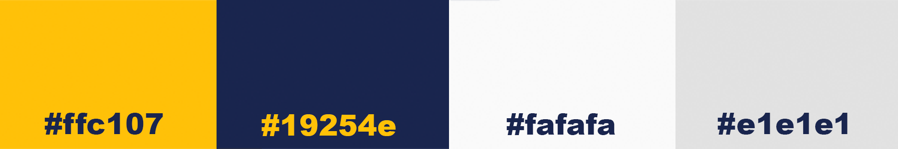

# Riverside Rowing Club Website 
## User-Centric Frontend Development Milestone Project 1

[insert image mock up here]

The [Riverside Rowing Club](https://kjluton.github.io/RiversideRowingClub/) website was built by Kirstyn Luton as part of the User Centric Frontend Development, Milestone 1 Project with Code Institute. The website presents Riverside Rowing Club as a successful rowing club in London. The rowing club has active members of all ages and abilities. The website allows the club to recruit new athletes are promote their 'Learn to Row' course which takes place every September. Users will find the content engaging, useful and will be able to navigate around the website in an efficient manner.

Disclaimer: This website has been built for entertainment and education purposes. It does not represent an actual rowing club. The website is build with HTML, CSS and Bootstrap framework. Javascript has also been used to provide an interactive element to some of the features. The website is responsive for multiple screen types.

## [View life website in github pages](https://kjluton.github.io/RiversideRowingClub/)
---

# Table of Contents

1. [UX](#ux)
    - [Website owner business goals](#website-owner-business-goals)
    - [User goals](#user-goals)
        - [New user goals](##new-user-goals)
        - [Returning user goals](##returning-user-goals)
    - [User stories](#user-stories)
    - [Wireframes](#wireframes)
        - [Homepage - Wireframe](###homepage-wireframe)
        - [Join Us Page - Wireframe](###join-us-page-wireframe)
        - [Members Page - Wireframe](###members-page-wireframe)
        - [Contact Us Page - Wireframe](###contact-us-page-wireframe)
    - [Surface](#surface)
2. [Features](#features)
3. [Technologies Used](#technologies-used)
4. [Testing](#testing)
    - [Functionality testing](#functionality-testing)
    - [Compatibility testing](#compatibility-testing)
    - [Code Validation](#code-validation)
    - [User stories testing](#user-stories-testing)
    - [Issues found during site development](#issues-found-during-site-development)
    - [Performance testing](#performance-testing)
5. [Deployment](#deployment)
6. [Credits](#credits)
7. [Screenshots](#screenshots)

# UX

## Website owner business goals

The website owner is the Riverside Rowing club's commitee. The goal of the website is to create an online presence for the Club which allows both members and prospective members to get important information about the club and it's facilities. The website will be a promotional tool for the Club, with a goal to engage and entice propspective members into joining the Club. It will do this by providing information about the coaches, facilities and achievements. 

## User goals

### New user goals (prospective Rowing Club members):

- User is able to find out about the Rowing Club’s facilities, membership prices and location.
- User is able to find out about the Rowing club’s goals and previous achievements, upcoming events and coaches.
- User can download a membership form and get application details.
- User can find the club location and contact relevant people.

### Returning user goals (Rowing Club members):
- User can find out about latest events the club is participating in.
- User can contact the club captain and or committee members.
- User can find important documents relating to the club.

## User stories

User 1:
Laura (40) is a mum of a Peter (15). Peter is a beginner rower and wants to join a rowing club in London. Laura is looking at the Rowing Club’s website to find out about the club, learn to row courses  and membership prices.

User 2:
John is a male, experienced rower in his early 20s. He has just moved to London and is not yet a member of the Rowing Club. He is looking to find out about the clubs’ facilities, achievements, future goals and membership details. He is looking at multiple clubs in the area to find the best fit for him. 

User 3:
Katie is a female in her late 30s. She is an experienced rower and a long-time member of the club. She wants to find out about upcoming race dates and volunteering opportunities. She also needs to buy some new kit as her old kit has worn out. 

## Wireframes

### Homepage - Wireframe

### Join Us Page - Wireframe

### Members Page - Wireframe

### Contact Us Page - Wireframe

## Surface

### Colours

The main colours used in this project are: 

* Riverside Rowing Club logo blue: #19254e
* Riverside Rowing Club logo yellow: #ffc107
* Main background colour: #fafafa
* Secondary background colour: #e1e1e1
* Links in main body: #dea700
* Hover on links: #566877

The link and link hover colours are intentionally duller than the main colours to improve readability whilst standing out from the copy.

### Fonts

The fonts are installed from [Google Fonts](https://fonts.google.com/):

* h1, h2, h3: 'Bebas Neue' with the secondary font as 'cursive' 
* h4, h5, p: 'Signika Negative' with the secondary font as 'sans-serif' 

### Images

I used a mixture of my own images and images from [Unsplash.com](https://unsplash.com/). I have credited these in the [credits section.](#credits)

[Back to table of contents](#table-of-contents)

_______
# Features

The website consists of 3 pages. All are accessible from the navigation menu. 

The website has the below features: 

## Existing Features

### Elements on every page

#### Navigation bar 

* The navbar is fully responsive and adapts to tablet and mobile devices by changing to a burger menu. 
* The navbar is a fixed feature which stays at the top of the page as the user scrolls down. This ensures they can navigate to another page easily if they wish to do so. 
* It features the Riverside Rowing Club Logo as an image, on the far left of the Navbar. The logo can be used as a navigation tool on all pages, to navigate back to the homepage. 
* To the right of the logo, there are 3 links which collapse into a burger menu on smaller screen sizes. The menu contains the following page names and links: 
    * Home
    * Join Us
    * Contact

#### Footer 
* Like the navigation bar, the footer is consitent across all pages. It has social links on the right hand side which change colour as you hover over them. Each link will open in a separate browser. On large and medium sized screens, the full Riverside Rowing Club logo is in the center. This disappears on smaller screens. The user can still clearly see the logo via the logo in the fixed navbar. 

#### Banner Images
* There are banner images across the site which provide context to the website as well as giving the user some insight to the activties the club participates in. They create emotive connections with the club. This will help with gaining new memberships. 

#### End of Section logos
* There are small oar icons (the oar-section of the RRC logo) which are displayed at the end of each text section. These are placed throughout the site to keep the layout consistent and tie the sections back to the RRC brand. 

#### Alert bar 
* The alert bar is visible on the "Homepage" and "Join Us" pages of the website. It is dismissable by a small cross on the far right of the bar. The alert bar notfies the user of the "Learn to Row" courses and has a call to action to encourage users to contact us and find out more. There is a link directing the user to the "Contact Us" page of the website, where the user can use the contact form to ask questions and book a slot on the course. 

* The dismisable feature is possible due to the JavaScript plugin. 

### Homepage

#### Welcome banner and hero image
* The welcome banner is at the top of the page with the hero image below. The structure is created through a link to the URL in the HTML. The header text adjusts to the screensize due to a media query. The hero image adjusts to screen size with the aid of the Bootstrap integration. 

#### About Us 
* The 'About Us' section informs new users about the club. It informs the user of the club location, the types of squads and gives the user an idea what kind of club the Riverside Rowing Club is. It informs the user of the 'Learn to Row' courses and provides a link to push any prospective members to the 'join us' page to find out more about joining the club. 

#### Useful links
* The 'Useful Link's section provides members and non-members with important links they will need within the rowing community, throughout the rowing season. The links are button links and the text changes colour and the mouse turns to a pointer to inform the user that they have hovered over a button. The links are external links and open on a new page. 

* When viewed on a small screened device, the buttons stack on top of each other instead of being two side by side. This allows them to stay large and improves usability whilst on a smaller screen. 

#### Racing and training kit 
* The 'Racing and Training Kit' section displays the kit the members can by. The information is displayed on Bootstrap 'cards' which have been adpated via customised CSS to match the style of the website. 

* This section includes information on who designed the kit, how to order the kit and a link to the contact form. 

## Join Us page 

#### Page header and image
* Similarly to the Homepage, the join us page has a yellow banner at the top with the page title. There is also a banner image below the yellow bar. This layout style is mirrored from the homepage to allow continuity across the site. 

#### Squads section
* The Squads section uses Bootstrap columns to display text next to imagery in a greyed out section. This 

#### Membership Fees 
* The Membership Fees section displays a table which clearly outlines the fees for the various squad and membership types. There is also a call to action to use the contact form to inquire about membership. 

#### Club Facilities
* The Club's facilities are displayed using Font Awesome icons. There is a header underneath the icon to explain the facility. 

#### Contact Us page
* The 'Contact Us' page hosts a contact form whereby users (both new and existing) can contact the Club Committee by filling out the form, selecting their query type from a drop down list provided and writing a text message. The form clears once the user submits the message. The fields are compulsory and prompt the user, should they miss a field. 

* To develop this section further, I would use an alert notification to inform the user that their message had been sent. 

## Future implementations

Further developments I would make to the sites features would be: 
* Add a confirmation notification for the contact form to notify the user of a successful message send. 
* Add a Membership creation area where prospective members can apply for membership online.
* Create a sign-in area for Members which can host exclusive members information about their fees, club training plans and member exclusive events. 
* Add a data capture form for a newsletter. 
* Add a google location with map integration to allow users to find the club easily.

[Back to table of contents](#table-of-contents)
_______

# Technologies Used

## Languages Used

* #### [HTML5](https://en.wikipedia.org/wiki/HTML5)
    HTML was used to build the website structure and overall layout. 

* #### [CSS3](https://en.wikipedia.org/wiki/CSS)
    CSS was used to style the website and build on the Bootstrap framework to customise the website to the owners brand. 

## Frameworks, Libraries and Programmes Used

* #### [Bootstrap](https://getbootstrap.com/)
    Bootstrap 5.0 was used to assist with a responsive design and basic structure of the website.  

* #### [JQuery](https://jquery.com/)
    JQuery was used with Bootstrap and aided the responsive and interactive elements of the site. 

* #### [jsDelivr](https://www.jsdelivr.com/)
    jsDelivr was used with Bootstrap and aided the responsive and interactive elements of the site.

* #### [Hover.css](https://ianlunn.github.io/Hover/)
    Hover.css allowed the buttons and links to change colour when the mouse hovers over them.    

* #### [Font Awesome](https://fontawesome.com/)
    Font Awesome was used to supply icons for the social links and 'Club Facilities' section. 

* #### [Google Fonts](https://fonts.google.com/): 
    Google Fonts were used to install the 'Bebas Neue' and 'Signika Negative' fonts which were used across the site. 

* #### [GitHub](https://github.com/)
    GitHub is used to store the project code. The code is pushed from GitPod to the GitHub respository. 

* #### [GitPod](https://www.gitpod.io/)
    Gitpod was used to write the code and the Git terminal was used for version control. The code was committed to Git and pushed to GitHub via the terminal. 

* #### [Balsamic](https://balsamiq.com/) 
    The Balsamic programme was used to build and develop the projects [Wireframes](#wireframes). 

* #### [Adobe Photoshop](https://www.photoshop.com/en) 
    Adobe Photoshop was used to create the logo, edit images and resize images for the website. 

[Back to table of contents](#table-of-contents)
_______

# Testing

### Functionality Testing

* All links and navigation on the website has been tested. Following feedback from this testing, a link to the 'Join Us' page was added on the homepage within the introduction 'about us' text. This helps drive new users through the site and enhances the 'join us' call to action. 

* Following a discussion with my mentor, we restructured the website to remove the 'Members' page. The decision came from 'Members' pages usually being behind a pay wall or log in section. This would be something I would look to develop into the website. 

### User Stories Testing

User 1:
<i>Laura (40) is a mum of a Peter (15). Peter is a beginner rower and wants to join a rowing club in London. Laura is looking at the Rowing Club’s website to find out about the club, learn to row courses  and membership prices.</i>

* Visiting the website as Laura, highlighted the lack of call to actions to get the user to the 'Join Us' page.  Three anonymous testers had Laura's persona to follow and they all fed back that they wanted to know more about the club from the first page, before they got to the 'Join Us' page. Following this feedback, I moved the blurb about the club, which was initially on the 'join us page' to the 'homepage'. I also added a call to action in the text leading the user to the 'join us' page if they are interested in joining us or starting rowing. 

* Feedback also raised the lack of information about the 'Learn to Row' course. Following this, I added a section on the 'Learn to Row" course on the 'Join us' page. 

User 2:
<i>John is a male, experienced rower in his early 20s. He has just moved to London and is not yet a member of the Rowing Club. He is looking to find out about the clubs’ facilities, achievements, future goals and membership details. He is looking at multiple clubs in the area to find the best fit for him.</i>

* Visiting the website as John highlighted the need to add more photos and atmostphere to the online presence of the club. The information was easy to find on the 'Join Us' page. The membership was presented clearly with a table. However the squad details were laid out with a lot of text. Following this testing and feedback, I updated the squads information section to have images and a bit more information about the achievements and goals of each squad. 

User 3:
<i>Katie is a female in her late 30s. She is an experienced rower and a long-time member of the club. She wants to find out about upcoming race dates and volunteering opportunities. She also needs to buy some new kit as her old kit has worn out.</i>

* As a current member of the club, Katie has all the information she needs on the first page. I think Katie and other members would benefit from the Members Specific area beind developed. However the useful links include the event calendar and tide times so most of the information she would need is easily accessible on the first page. 

* Katie can access the contact form to contact the committee about volunteering and buying new kit. A development could involve adding a volunteering page to outline different areas members can volunteer within the club. 

### Code Validation

* #### [W3C Markup Validation Service - Confirmed results](https://validator.w3.org/nu/?doc=https%3A%2F%2Fkjluton.github.io%2FRiversideRowingClub%2F)
* #### W3C CSS Validation Service - Confirmed results - Using direct input CSS validation. 

    

### Issues Found During Site Development
* Nav Bar collapse not working - Once I corrected the Bootstrap code and JavaScript plug in, the burger menu worked. 
* Images stretched when using Safari on an iphone. This was fed back to me following peer testing on Slack. I corrected the code by adding a height value to the images. 
* Buttons had background colours and borders as the same colour. This was rejected in the validator. I updated the code to 'border-style:none;' to fit the errors. 
* Hero image covering too much of the main screen. This wasn't good for usability as the user wasn't able to see a clear navigation path. I reduced the height of the image so it didn't take up as much of the screen. 
* 

[Back to table of contents](#table-of-contents)
_______
# Deployment

The project was deployed to GitHub Pages. Gitpod was used as the development workspace. I committed and logged all changes to the project, using the git command control system. At the end of each session, I used the git push command in the GitPod terminal to push all changes to the GitHub repository. 

To deploy the project I had to:

* Log in to GitHub and click on repository to deploy (https://github.com/KJLuton/RiversideRowingClub)
* Select 'Settings' and find the ‘Pages’ section at the bottom of the vertical menu, on the left hand side.
* From 'source', click where it says 'none' and update to 'branch: Master'. 
* Click 'save' and refresh your page to confirm deployment.  

To run locally: 
* Log into GitHub and click on the repository to download (https://github.com/KJLuton/RiversideRowingClub)
* Select 'code' and click 'Download" on the Zip File. 
* Once you download the file, you can extract it and use it in your local environment. 

[Back to table of contents](#table-of-contents)
_______
# Credits

## Content

The content on the page was written by myself, Kirstyn Luton. 
The logo was created by myself using photoshop. The icon in the logo is from [Favicon](https://www.flaticon.com/free-icons/oar). 

## Media

The images in the folder 'own' are owned by myself and I have the rights to use them. The details of where they came from are below.

The following images are from a rowing club called West End. These photos were taken by [Rowing Celebration](https://www.rowingcelebration.com/index): 
* [Double Rowing Banner](assets/images/own/doublerowing_joinuspage.png)
* [Group Photo](assets/images/own/novice_group_image_small.jpg)
* [Hug](assets/images/own/rowingmhug.jpeg)

The following images are from a rowing club called Tideway Scullers. These photos were taken by [Ben Rodford Photography](https://www.benrodfordphotography.co.uk/index):
* [Henley Podium](assets/images/own/henelypodium.jpeg)
* [Henley Eight Rowing](assets/images/own/tssrowingeight_banner_homepage.jpg)

#### Photos (General Rowing): 

Photo by <a href="https://unsplash.com/@mattyfours?utm_source=unsplash&utm_medium=referral&utm_content=creditCopyText">Matthew Fournier</a> on <a href="https://unsplash.com/s/photos/rowing?utm_source=unsplash&utm_medium=referral&utm_content=creditCopyText">Unsplash</a>

Photo by <a href="https://unsplash.com/@anikinearthwalker?utm_source=unsplash&utm_medium=referral&utm_content=creditCopyText">Dimitry Anikin</a> on <a href="https://unsplash.com/s/photos/rowing?utm_source=unsplash&utm_medium=referral&utm_content=creditCopyText">Unsplash</a>

Photo by <a href="https://unsplash.com/@jeffreyflin?utm_source=unsplash&utm_medium=referral&utm_content=creditCopyText">Jeffrey F Lin</a> on <a href="https://unsplash.com/s/photos/rowing?utm_source=unsplash&utm_medium=referral&utm_content=creditCopyText">Unsplash</a>
  
Photo by <a href="https://unsplash.com/@rhysatwork?utm_source=unsplash&utm_medium=referral&utm_content=creditCopyText">Rhys Moult</a> on <a href="https://unsplash.com/s/photos/rowing?utm_source=unsplash&utm_medium=referral&utm_content=creditCopyText">Unsplash</a>
  
Photo by <a href="https://unsplash.com/@mitchel3uo?utm_source=unsplash&utm_medium=referral&utm_content=creditCopyText">Mitchell Luo</a> on <a href="https://unsplash.com/s/photos/rowing?utm_source=unsplash&utm_medium=referral&utm_content=creditCopyText">Unsplash</a>
  
Photo by <a href="https://unsplash.com/@pbernardon?utm_source=unsplash&utm_medium=referral&utm_content=creditCopyText">Pascal Bernardon</a> on <a href="https://unsplash.com/s/photos/rowing?utm_source=unsplash&utm_medium=referral&utm_content=creditCopyText">Unsplash</a>
  
Photo by <a href="https://unsplash.com/@kjkranz?utm_source=unsplash&utm_medium=referral&utm_content=creditCopyText">Kyle Kranz</a> on <a href="https://unsplash.com/s/photos/rowing?utm_source=unsplash&utm_medium=referral&utm_content=creditCopyText">Unsplash</a>
  
#### Photos (Coaches):

Photo by <a href="https://unsplash.com/@stephtcook?utm_source=unsplash&utm_medium=referral&utm_content=creditCopyText">Stephanie Cook</a> on <a href="https://unsplash.com/s/photos/smiling-headshot?utm_source=unsplash&utm_medium=referral&utm_content=creditCopyText">Unsplash</a>
  
Photo by <a href="https://unsplash.com/@ryanhoffman007?utm_source=unsplash&utm_medium=referral&utm_content=creditCopyText">Ryan Hoffman</a> on <a href="https://unsplash.com/s/photos/smiling-headshot?utm_source=unsplash&utm_medium=referral&utm_content=creditCopyText">Unsplash</a>
  
Photo by <a href="https://unsplash.com/@kyddvisuals?utm_source=unsplash&utm_medium=referral&utm_content=creditCopyText">Dillon Kydd</a> on <a href="https://unsplash.com/s/photos/smiling-headshot?utm_source=unsplash&utm_medium=referral&utm_content=creditCopyText">Unsplash</a>
  
Photo by <a href="https://unsplash.com/@jeffreyflin?utm_source=unsplash&utm_medium=referral&utm_content=creditCopyText">Jeffrey F Lin</a> on <a href="https://unsplash.com/s/photos/rowing-coach?utm_source=unsplash&utm_medium=referral&utm_content=creditCopyText">Unsplash</a>

#### README.md File Assistance

I used the following README.md files for assistance in structure and guidance on how to write a README.md file: 

[README.md 1](https://github.com/AJGreaves/familyhub/blob/master/README.md)
[README.md 2](https://github.com/marcin-kli/MP1/blob/Milestone-Projects/README.md )

#### Code:

To write the code I used tutorials from the Code Institute lessons (HTML Essentials, CSS Essentials and User Centric Front End Development) paired with Bootstrap assitance and guidance on the Boostrap website. 

I also used the following links to support my code writing: 
* [Hero Image Assistance](https://www.w3schools.com/howto/howto_css_hero_image.asp)
* [Creating a favicon](https://www.digitalocean.com/community/tutorials/how-to-add-a-favicon-to-your-website-with-html)
* [Creating a parallax](https://www.w3schools.com/howto/howto_css_parallax.asp)

# Acknowledgements

Thank you to my mentor Adegbenga Adeye for his support and guidance during the project development. 
 
Thank you to the following Code Institute students who peer reviewed my work and found some bugs and made some creative suggestions. 
* Claire Lemonnier
* Richard L
* Oliver Cadman
 

Thank you to my family and friends who tested the site and provided valuable feedback. 

[Back to Table of contents](#table-of-contents)
